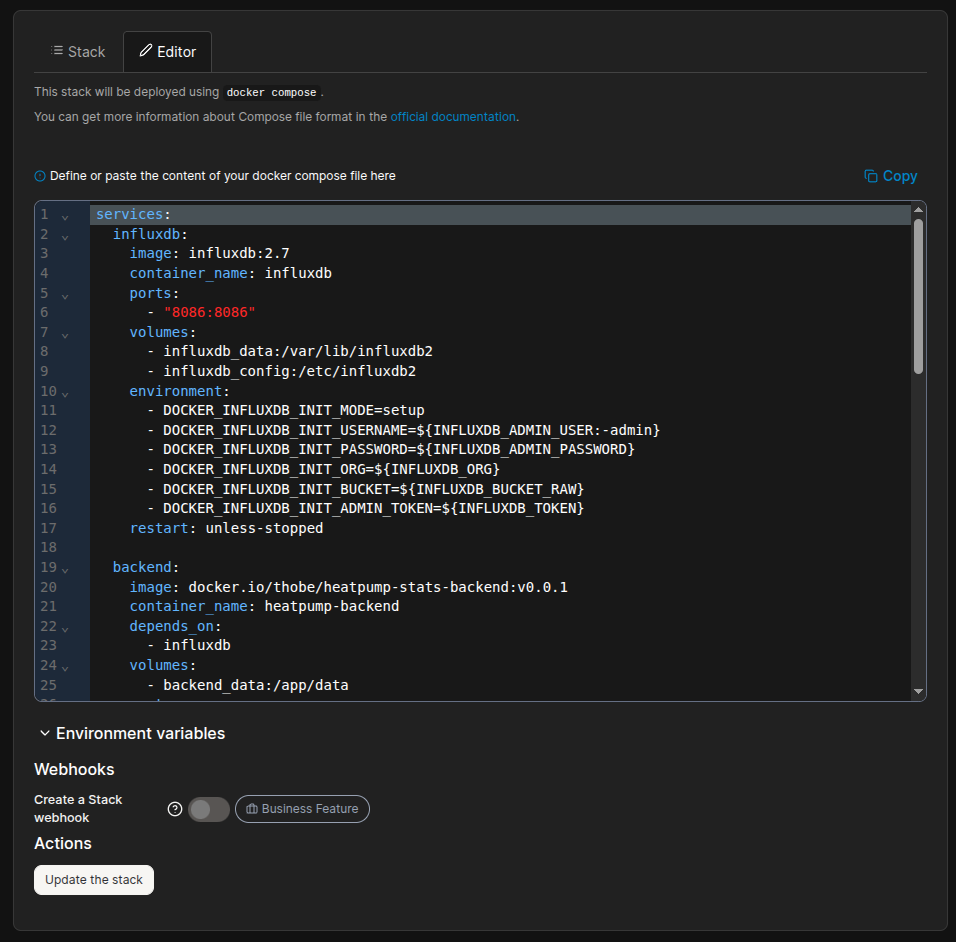
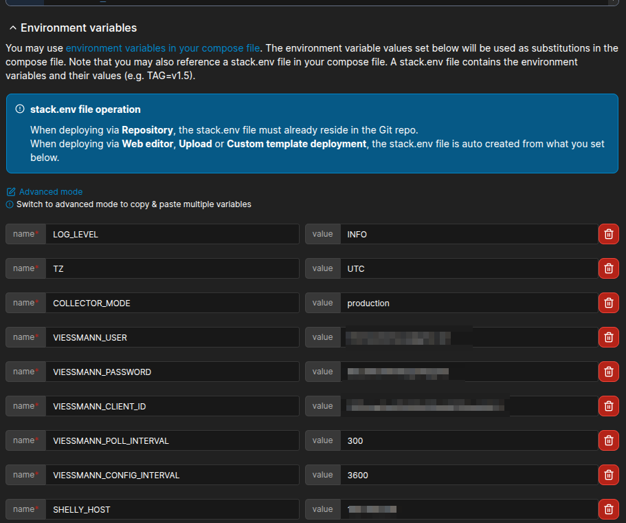

# Docker

This document describes how to build, push and run the application as a dockerized service.

## Image Structure

The frontend image contains an nginx that serves the UI application.
The backend image contains both the python API and the data collector daemon.

### API and Collector Containers

The backend image can be instantiated as a api container and a data collector daemon container. This is possible using the entrypoints as defined in [backend/Dockerfile](backend/Dockerfile).

## Build and run

```bash
# builds the:
# 1. backend image 'docker.io/thobe/heatpump-stats-backend' tagged as latest
# 2. frontend image 'docker.io/thobe/heatpump-stats-frontend' tagged as latest
make docker.build

# pushes the images to docker.io/thobe/
# maybe a docker login is required first
# The images are pushed with a version tag. The caller is prompted to provide the version tag.
# Per default the current git-tag is suggested.
make docker.push

# Start the whole setup (including the needed infrastructure, such as InfluxDB),
# using the latest locally build images
# The application can be reached at http://localhost:8081
make docker.local.up

# Stop the docker containers that were brought up with docker.local.up
make docker.local.down

# Start the whole setup (including the needed infrastructure, such as InfluxDB),
# using the latest images that where pushed to docker.io/thobe/
# The application can be reached at http://localhost:8081
make docker.prod.up

# Stop the docker containers that were brought up with docker.prod.up
make docker.prod.down
```

## Environment Variables

### Available Environment Variables

| EnvVar                      | Description                                     | Default | Container                    |
| --------------------------- | ----------------------------------------------- | ------- | ---------------------------- |
| INFLUXDB_ADMIN_USER         | Username for the InfluxDB admin user            | admin   | influxdb, backend, collector |
| INFLUXDB_ADMIN_PASSWORD     | Password for the InfluxDB admin user            | -       | influxdb, backend, collector |
| INFLUXDB_ORG                | InfluxDB organization name                      | -       | influxdb, collector          |
| INFLUXDB_BUCKET_RAW         | InfluxDB bucket for raw data                    | -       | influxdb, collector          |
| INFLUXDB_BUCKET_DOWNSAMPLED | InfluxDB bucket for downsampled data            | -       | collector                    |
| INFLUXDB_TOKEN              | InfluxDB admin token for authentication         | -       | influxdb, backend, collector |
| INFLUXDB_URL                | URL to the InfluxDB instance                    | -       | backend, collector           |
| SQLITE_DB_PATH              | Path to the SQLite database file                | -       | backend, collector           |
| VIESSMANN_USER              | Viessmann API username                          | -       | collector                    |
| VIESSMANN_PASSWORD          | Viessmann API password                          | -       | collector                    |
| VIESSMANN_CLIENT_ID         | Viessmann API client ID                         | -       | collector                    |
| VIESSMANN_POLL_INTERVAL     | Polling interval for Viessmann data (seconds)   | -       | collector                    |
| VIESSMANN_CONFIG_INTERVAL   | Polling interval for Viessmann config (seconds) | -       | collector                    |
| SHELLY_HOST                 | Hostname/IP of the Shelly power meter           | -       | collector                    |
| SHELLY_PASSWORD             | Password for the Shelly device                  | -       | collector                    |
| SHELLY_POLL_INTERVAL        | Polling interval for Shelly data (seconds)      | -       | collector                    |
| COLLECTOR_MODE              | Mode for the collector daemon                   | -       | collector                    |

### Local Setup

The environment-variables for the local setup can be provided via .env.docker file.
This file has to be placed at [cmd/local-setup](cmd/local-setup).
One can just use the example file [.env.docker.example](./cmd/local-setup/.env.docker.example), fill the variables and rename it to .env.docker.

### Portainer, Synology, Kubernetes or similar

The environment-variables can be also provided via pure environment variables.

#### Portainer

For portainer one can directly use the [cmd/local-setup/docker-compose.prod.yml](./cmd/local-setup/docker-compose.prod.yml) as stack-definition file.


And provide the environment variables in the "Env" section.

