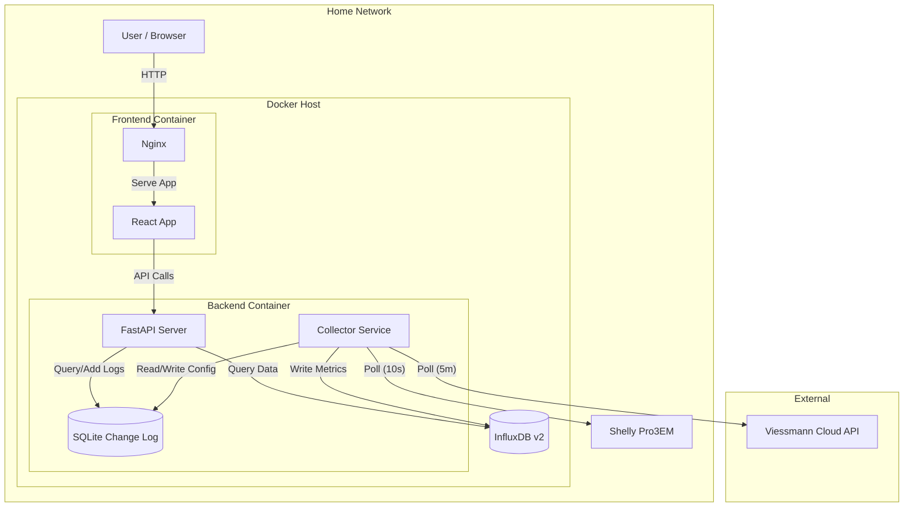

# Heatpump Monitoring System Plan

## 1. Goal

Build a software solution to monitor the performance of a Viessmann heatpump system over time.
The system will combine data from:

- **Viessmann API**: Temperature sensors, supply power, status.
- **Shelly Pro3EM**: Real-time power consumption (since it's not available via the Viessmann API).

The solution will be containerized and run on a home server, providing a web dashboard for visualization.
It will also track configuration changes (e.g., temperature settings, schedules) to correlate them with performance improvements.

## 2. Architecture & Tech Stack

### Database: **InfluxDB v2**

- **Why**: Industry standard for IoT time-series data. Handles high-frequency writes (from Shelly) efficiently and integrates well with Python.
- **Deployment**: Docker container.

### Database (Change Log): **SQLite**

- **Why**: Lightweight, serverless, relational database perfect for storing structured user change logs (optimization notes) and **automatically detected configuration changes** (e.g., schedule updates, target temperature changes). No extra container required (file-based).
- **Deployment**: Embedded in the Backend container (data stored on a Docker Volume).

### Backend: **Python + FastAPI**

- **Why**: Modern, high-performance, and easy to build REST APIs. Python is already used for the data collection logic.
- **Role**:
  - Expose data from InfluxDB to the frontend.
  - Manage the data collection service (background tasks).
  - Manage system change logs (CRUD operations via SQLite).

### Frontend: **React (TypeScript + Tailwind CSS)**

- **Why**:
  - **React**: Modern component-based framework with a rich ecosystem for charting (e.g., Recharts, Victory).
  - **TypeScript**: Ensures type safety, reducing bugs when handling API data.
  - **Tailwind CSS**: Rapid styling with a utility-first approach, ensuring a consistent look.
- **Role**: Visualize time-series data, status, and efficiency metrics.

### Infrastructure: **Docker**

- **Why**: Easy deployment and isolation.
- **Persistence**: Docker Volumes will be used to ensure InfluxDB data survives container restarts.
- **Components** (3 separate containers):
  - `influxdb`: Time-series database (stores data).
  - `backend`: Python service (runs Collector + FastAPI).
  - `frontend`: Nginx web server (serves the React application).

## 3. Required Viessmann Data

To ensure the plan is feasible, the following data points must be available via the Viessmann API for your specific device (`CU401B_G`).

### General System

| Data Point                | Purpose            | API Feature / Method (PyViCare)                  |
| :------------------------ | :----------------- | :----------------------------------------------- |
| **Outside Temperature**   | Dashboard & Charts | `getOutsideTemperature()`                        |
| **Return Temperature**    | COP Calc (DeltaT)  | `getReturnTemperature()`                         |
| **Compressor Modulation** | JAZ Calculation    | `heating.compressors.0.sensors.power` (Property) |
| **Rated Power**           | JAZ Calculation    | `heating.compressors.0.power` (Property)         |

### Heating Circuits (Iterate over all available circuits)

| Data Point                | Purpose              | API Feature / Method (PyViCare)                      |
| :------------------------ | :------------------- | :--------------------------------------------------- |
| **Supply Temperature**    | Dashboard & COP Calc | `circuit.getSupplyTemperature()`                     |
| **Heating Schedule**      | Change Log           | `circuit.getHeatingSchedule()`                       |
| **Target Temp (Current)** | Change Log           | `circuit.getCurrentDesiredTemperature()`             |
| **Target Temp (Comfort)** | Change Log           | `circuit.getDesiredTemperatureForProgram("comfort")` |
| **Target Temp (Normal)**  | Change Log           | `circuit.getDesiredTemperatureForProgram("normal")`  |
| **Target Temp (Reduced)** | Change Log           | `circuit.getDesiredTemperatureForProgram("reduced")` |

### Domestic Hot Water (DHW)

| Data Point              | Purpose    | API Feature / Method (PyViCare)           |
| :---------------------- | :--------- | :---------------------------------------- |
| **Storage Temperature** | Dashboard  | `getDomesticHotWaterStorageTemperature()` |
| **Target Temperature**  | Change Log | `getDomesticHotWaterDesiredTemperature()` |
| **DHW Schedule**        | Change Log | `getDomesticHotWaterSchedule()`           |

### Circulation Pump

| Data Point        | Purpose    | API Feature / Method (PyViCare)                      |
| :---------------- | :--------- | :--------------------------------------------------- |
| **Pump Status**   | Dashboard  | `heating.dhw.pumps.circulation` (Property -> status) |
| **Pump Schedule** | Change Log | `heating.dhw.pumps.circulation.schedule` (Property)  |

_Note: Direct "Current Heat Production" is missing. We will estimate it using `Rated Power _ Modulation %`.\*

## 4. Implementation Steps

### Phase 1: Infrastructure & Data Collection

0. **API Verification (Completed)**:

   - Verified that `CU401B_G` supports necessary data points via specific properties.
   - **Strategy Update**: JAZ will be calculated using estimated thermal power (Modulation \* Rated Power).

1. **Docker Setup**: Create `docker-compose.yml` to spin up InfluxDB.
2. **Shelly Integration**: Implement a Python module to fetch power data from the Shelly Pro3EM (using local RPC API `http://<ip>/rpc/EM.GetStatus`).
3. **Collector Service**:
   - Create a main loop in Python.
   - **Viessmann**: Poll every 5 minutes (well within the 1450 calls/day limit).
     - **Sensors**: Fetch Outside, Return, Supply (per circuit), DHW Storage, Compressor Modulation. -> InfluxDB.
     - **Configuration**: Fetch Schedules (Circuits, DHW, Circ. Pump) & Target Temps. -> Compare with previous state -> Write changes to SQLite (Change Log).
   - **Shelly**: Poll every 10 seconds for high resolution.
   - **Storage**: Write batched data points to InfluxDB.

### Phase 2: Backend API

1. **FastAPI Setup**: Initialize a project structure.
2. **API Endpoints**:
   - `GET /api/status`: Current system status (latest readings).
   - `GET /api/history`: Historical data for charts (accepting time ranges).
   - `GET /api/changelog`: Retrieve user change logs.
   - `POST /api/changelog`: Add a new optimization note/change log entry.
3. **InfluxDB Querying**: Implement Flux queries to retrieve aggregated data for the API.

### Phase 3: Frontend Dashboard

1. **Scaffold React App**: Use Vite for a fast setup.
2. **Dashboard Layout**:
   - **Current Status Cards**: Current Power (W), Outside Temp (°C), Supply Temp (°C).
   - **Charts**: Power consumption over time, Temperature curves.
   - **Change Log**: A list/timeline of manual optimization notes.
3. **Integration**: Connect frontend to FastAPI endpoints.

## 5. Metrics & Calculations

### Handling Data Resolution Mismatch

- **Challenge**: Shelly provides data every 10s (high res), while Viessmann provides data every 5m (medium res).
- **Strategy**: **Downsampling & Alignment**.
  - We cannot calculate a valid COP every 10s because the thermal output is unknown.
  - We will calculate metrics at the **5-minute intervals** (aligned with Viessmann polls).
  - For the calculation, we will use the **average electrical power** from Shelly over the specific 5-minute window.

### Key Metrics

1. **COP (Coefficient of Performance)**

   - **Formula**: $COP = \frac{\text{Thermal Power Output (kW)}}{\text{Electrical Power Input (kW)}}$
   - **Implementation**: Calculated by the **Collector Service** at each 5m interval.
     - **Thermal Power**: Estimated using `Rated Power (16kW) * Modulation (%)` (same as JAZ).
       - _Note: A secondary `COP_delta_t` will also be calculated using the Delta T method for comparison._
     - **Electrical Power**: Average Shelly Power over the last 5m (queried from InfluxDB).
     - Store calculated `COP` as a new measurement in InfluxDB.

2. **Power Consumption (Day/Week/Month/Year)**

   - **Source**: Shelly `total_act_energy` (cumulative counter).
   - **Implementation**: **Flux Queries** in the Backend API.
     - Use `aggregateWindow(every: 1d/1w/1mo, fn: spread)` to calculate consumption per period.

3. **JAZ (Jahresarbeitszahl / Seasonal COP)**

   - **Formula**: $JAZ = \frac{\sum \text{Thermal Energy (kWh)}}{\sum \text{Electrical Energy (kWh)}}$
   - **Implementation**:
     - **Thermal Energy**: Calculated by integrating the **Estimated Heat Production Rate** over time.
       - **Primary Strategy (Modulation)**:
         - Formula: `Power (kW) = Rated Power (16kW) * Modulation (%)`.
         - API Properties: `heating.compressors.0.power` (Rated) and `heating.compressors.0.sensors.power` (Modulation).
       - **Secondary Strategy (Delta T)**:
         - Formula: $P (kW) = \dot{V} (m^3/h) \times 1.16 (kWh/m^3K) \times (T_{supply} - T_{return})$.
         - Requires: User-configured `ESTIMATED_FLOW_RATE` (since pump speed is unknown).
         - Purpose: Validation and comparison. Stored as `thermal_power_delta_t`.
       - Logic: `Energy (kWh) = Estimated Power (kW) * Interval (h)`. Sum these values over the year.
     - **Electrical Energy**: Sum of Shelly consumption over the same period.
     - Calculated dynamically by the Backend API.

4. **Yearly Estimation**

   - **Implementation**: Backend API logic.
   - **Method**: Extrapolation based on current average daily consumption + remaining days.

5. **Thermal Power Output**
   - **Implementation**: Calculated by the **Collector Service** at each 5m interval and stored as two separate measurements in InfluxDB.
   - **Metric A (Modulation Based)**:
     - Formula: `Power (kW) = Rated Power (16kW) * Modulation (%)`.
     - Measurement Name: `thermal_power_modulation`.
   - **Metric B (Delta T Based)**:
     - Formula: $P (kW) = \dot{V} (m^3/h) \times 1.16 (kWh/m^3K) \times (T_{supply} - T_{return})$.
     - Measurement Name: `thermal_power_delta_t`.
     - Note: Relies on `ESTIMATED_FLOW_RATE` (user setting). And relies on the assumption that the flow rate is constant.

## 6. Key Considerations

- **Rate Limiting**: Strict enforcement of Viessmann API limits is crucial to avoid bans (max. 1450 calls for a time window of 24 hours). See [Viessmann Developer FAQ](https://developer.viessmann-climatesolutions.com/start/faq.html).
- **Data Correlation**: Timestamps need to be aligned. InfluxDB handles this well, but we might need to interpolate data if we want to calculate COP (Coefficient of Performance) in real-time (combining slow Viessmann data with fast Shelly data).
- **Local Access**: Shelly should be accessed via local IP to avoid cloud dependency.

## 7. Component Diagram

