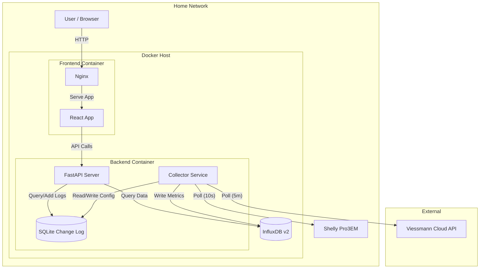

# Heatpump Monitoring System Plan

## 1. Goal

Build a software solution to monitor the performance of a Viessmann heatpump system over time.
The system will combine data from:

- **Viessmann API**: Temperature sensors, supply power, status.
- **Shelly Pro3EM**: Real-time power consumption (since it's not available via the Viessmann API).

The solution will be containerized and run on a home server, providing a web dashboard for visualization.
It will also track configuration changes (e.g., temperature settings, schedules) to correlate them with performance improvements.

## 2. Architecture & Tech Stack

### Database: **InfluxDB v2**

- **Why**: Industry standard for IoT time-series data. Handles high-frequency writes (from Shelly) efficiently and integrates well with Python.
- **Deployment**: Docker container.

### Database (Change Log): **SQLite**

- **Why**: Lightweight, serverless, relational database perfect for storing structured user change logs (optimization notes) and **automatically detected configuration changes** (e.g., schedule updates, target temperature changes). No extra container required (file-based).
- **Deployment**: Embedded in the Backend container (data stored on a Docker Volume).

### Backend: **Python + FastAPI**

- **Why**: Modern, high-performance, and easy to build REST APIs. Python is already used for the data collection logic.
- **Role**:
  - Expose data from InfluxDB to the frontend.
  - Manage the data collection service (background tasks).
  - Manage system change logs (CRUD operations via SQLite).

### Frontend: **React (TypeScript + Tailwind CSS)**

- **Why**:
  - **React**: Modern component-based framework with a rich ecosystem for charting (e.g., Recharts, Victory).
  - **TypeScript**: Ensures type safety, reducing bugs when handling API data.
  - **Tailwind CSS**: Rapid styling with a utility-first approach, ensuring a consistent look.
  - **State Management**: **React Query (TanStack Query)** for server state (API data, caching, polling) + **Context API** for global app state (Auth).
- **Role**: Visualize time-series data, status, and efficiency metrics.

### Infrastructure: **Docker**

- **Why**: Easy deployment and isolation.
- **Persistence**: Docker Volumes will be used to ensure InfluxDB data survives container restarts.
- **Components** (3 separate containers):
  - `influxdb`: Time-series database (stores data).
  - `backend`: Python service (runs Collector + FastAPI).
  - `frontend`: Nginx web server (serves the React application).

### Security

- **Authentication**: Token-based authentication (OAuth2 Password Flow) for API access.
  - **Frontend**: Custom Login Screen.

### Security & Secrets

- **Strategy**: Environment Variables via `.env` file.
- **Implementation**:
  - All sensitive data (Viessmann credentials, InfluxDB tokens, App Secrets) are stored in a `.env` file on the host.
  - This file is **strictly git-ignored**.
  - Docker Compose injects these variables into containers at runtime.
  - _Alternative_: For higher security, Docker Secrets (file-based) can be used if needed.

## 3. Required Viessmann DataTo ensure the plan is feasible, the following data points must be available via the Viessmann API for your specific device (`CU401B_G`).

### General System

| Data Point                | Purpose            | API Feature / Method (PyViCare)                  |
| :------------------------ | :----------------- | :----------------------------------------------- |
| **Outside Temperature**   | Dashboard & Charts | `getOutsideTemperature()`                        |
| **Return Temperature**    | COP Calc (DeltaT)  | `getReturnTemperature()`                         |
| **Compressor Modulation** | JAZ Calculation    | `heating.compressors.0.sensors.power` (Property) |
| **Rated Power**           | JAZ Calculation    | `heating.compressors.0.power` (Property)         |

### Heating Circuits (Iterate over all available circuits)

| Data Point                | Purpose              | API Feature / Method (PyViCare)                      |
| :------------------------ | :------------------- | :--------------------------------------------------- |
| **Supply Temperature**    | Dashboard & COP Calc | `circuit.getSupplyTemperature()`                     |
| **Heating Schedule**      | Change Log           | `circuit.getHeatingSchedule()`                       |
| **Target Temp (Current)** | Change Log           | `circuit.getCurrentDesiredTemperature()`             |
| **Target Temp (Comfort)** | Change Log           | `circuit.getDesiredTemperatureForProgram("comfort")` |
| **Target Temp (Normal)**  | Change Log           | `circuit.getDesiredTemperatureForProgram("normal")`  |
| **Target Temp (Reduced)** | Change Log           | `circuit.getDesiredTemperatureForProgram("reduced")` |

### Domestic Hot Water (DHW)

| Data Point              | Purpose    | API Feature / Method (PyViCare)           |
| :---------------------- | :--------- | :---------------------------------------- |
| **Storage Temperature** | Dashboard  | `getDomesticHotWaterStorageTemperature()` |
| **Target Temperature**  | Change Log | `getDomesticHotWaterDesiredTemperature()` |
| **DHW Schedule**        | Change Log | `getDomesticHotWaterSchedule()`           |

### Circulation Pump

| Data Point        | Purpose    | API Feature / Method (PyViCare)                      |
| :---------------- | :--------- | :--------------------------------------------------- |
| **Pump Status**   | Dashboard  | `heating.dhw.pumps.circulation` (Property -> status) |
| **Pump Schedule** | Change Log | `heating.dhw.pumps.circulation.schedule` (Property)  |

_Note: Direct "Current Heat Production" is missing. We will estimate it using `Rated Power _ Modulation %`.\*

## 4. Implementation Steps

### Phase 1: Infrastructure & Data Collection

0. **API Verification (Completed)**:

   - Verified that `CU401B_G` supports necessary data points via specific properties.
   - **Strategy Update**: JAZ will be calculated using estimated thermal power (Modulation \* Rated Power).

1. **Docker Setup**: Create `docker-compose.yml` to spin up InfluxDB.
2. **Shelly Integration**: Implement a Python module to fetch power data from the Shelly Pro3EM (using local RPC API `http://<ip>/rpc/EM.GetStatus`).
3. **Collector Service**:
   - Create a main loop in Python.
   - **Viessmann**:
     - **Sensors (Every 5 minutes)**:
       - Use **Batch Fetching** (`fetch_all_features()`) to retrieve all data in a **single API call**.
       - Parse JSON locally to extract Outside, Return, Supply (per circuit), DHW Storage, Compressor Modulation. -> InfluxDB.
     - **Configuration (Every 5 hours)**:
       - Use the same batch fetch mechanism (or a separate one if needed, but batch is preferred).
       - Extract Schedules (Circuits, DHW, Circ. Pump) & Target Temps. -> Compare with previous state -> Write changes to SQLite (Change Log).
   - **Shelly**: Poll every 10 seconds for high resolution.
   - **Storage**: Write batched data points to InfluxDB.

### Phase 2: Backend API

1. **FastAPI Setup**: Initialize a project structure.
2. **Authentication**:
   - Implement `POST /token` endpoint for login (username/password).
   - Protect API endpoints (`/api/history`, `/api/changelog`) using `OAuth2PasswordBearer`.
   - Use environment variables for the single user credentials.
3. **API Endpoints**:
   - `GET /api/status`: Current system status (latest readings).
   - `GET /api/history`: Historical data for charts (accepting time ranges).
   - `GET /api/changelog`: Retrieve user change logs.
   - `POST /api/changelog`: Add a new optimization note/change log entry.
4. **InfluxDB Querying**: Implement Flux queries to retrieve aggregated data for the API.
5. **Documentation**:
   - Enable automatic Swagger UI (`/docs`) and ReDoc (`/redoc`) for API exploration.
   - Ensure all endpoints have proper Pydantic models and docstrings.

### Phase 3: Frontend Dashboard

1. **Scaffold React App**: Use Vite for a fast setup.
   - Install `tanstack/react-query` for efficient data fetching and caching.
2. **Authentication UI**:
   - Create a Login Page.
   - Implement `AuthProvider` context to manage login state/tokens.
   - Protect dashboard routes (redirect to login if unauthenticated).
3. **Dashboard Layout**:
   - **Current Status Cards**: Current Power (W), Outside Temp (°C), Supply Temp (°C).
   - **Charts**: Power consumption over time, Temperature curves.
   - **Change Log**: A list/timeline of manual optimization notes.
4. **Integration**: Connect frontend to FastAPI endpoints.

## 5. Metrics & Calculations

### Handling Data Resolution Mismatch

- **Challenge**: Shelly provides data every 10s (high res), while Viessmann provides data every 5m (medium res).
- **Strategy**: **Downsampling & Alignment**.
  - We cannot calculate a valid COP every 10s because the thermal output is unknown.
  - We will calculate metrics at the **5-minute intervals** (aligned with Viessmann polls).
  - For the calculation, we will use the **average electrical power** from Shelly over the specific 5-minute window.

### Key Metrics

1. **COP (Coefficient of Performance)**

   - **Formula**: $COP = \frac{\text{Thermal Power Output (kW)}}{\text{Electrical Power Input (kW)}}$
   - **Implementation**: Calculated by the **Collector Service** at each 5m interval.
     - **Thermal Power**: Estimated using `Rated Power (16kW) * Modulation (%)` (same as JAZ).
       - _Note: A secondary `COP_delta_t` will also be calculated using the Delta T method for comparison._
     - **Electrical Power**: Average Shelly Power over the last 5m (queried from InfluxDB).
     - Store calculated `COP` as a new measurement in InfluxDB.

2. **Power Consumption (Day/Week/Month/Year)**

   - **Source**: Shelly `total_act_energy` (cumulative counter).
   - **Implementation**: **Flux Queries** in the Backend API.
     - Use `aggregateWindow(every: 1d/1w/1mo, fn: spread)` to calculate consumption per period.

3. **JAZ (Jahresarbeitszahl / Seasonal COP)**

   - **Formula**: $JAZ = \frac{\sum \text{Thermal Energy (kWh)}}{\sum \text{Electrical Energy (kWh)}}$
   - **Implementation**:
     - **Thermal Energy**: Calculated by integrating the **Estimated Heat Production Rate** over time.
       - **Primary Strategy (Modulation)**:
         - Formula: `Power (kW) = Rated Power (16kW) * Modulation (%)`.
         - API Properties: `heating.compressors.0.power` (Rated) and `heating.compressors.0.sensors.power` (Modulation).
       - **Secondary Strategy (Delta T)**:
         - Formula: $P (kW) = \dot{V} (m^3/h) \times 1.16 (kWh/m^3K) \times (T_{supply} - T_{return})$.
         - Requires: User-configured `ESTIMATED_FLOW_RATE` (since pump speed is unknown).
         - Purpose: Validation and comparison. Stored as `thermal_power_delta_t`.
       - Logic: `Energy (kWh) = Estimated Power (kW) * Interval (h)`. Sum these values over the year.
     - **Electrical Energy**: Sum of Shelly consumption over the same period.
     - Calculated dynamically by the Backend API.

4. **Yearly Estimation**

   - **Implementation**: Backend API logic.
   - **Method**: Extrapolation based on current average daily consumption + remaining days.

5. **Thermal Power Output**
   - **Implementation**: Calculated by the **Collector Service** at each 5m interval and stored as two separate measurements in InfluxDB.
   - **Metric A (Modulation Based)**:
     - Formula: `Power (kW) = Rated Power (16kW) * Modulation (%)`.
     - Measurement Name: `thermal_power_modulation`.
   - **Metric B (Delta T Based)**:
     - Formula: $P (kW) = \dot{V} (m^3/h) \times 1.16 (kWh/m^3K) \times (T_{supply} - T_{return})$.
     - Measurement Name: `thermal_power_delta_t`.
     - Note: Relies on `ESTIMATED_FLOW_RATE` (user setting). And relies on the assumption that the flow rate is constant.

## 6. Key Considerations

- **Rate Limiting Strategy**:
  - **Constraint**: Max 1450 calls per rolling 24-hour window.
  - **Budget Calculation**:
    - Polling (5m interval): 288 calls/day.
    - Token Refresh: ~24 calls/day.
    - Buffer for restarts/debugging: ~100 calls/day.
    - **Total Projected**: ~412 calls/day (Utilization: ~28%).
  - **Enforcement**:
    - The Collector Service will track API usage in a persistent store (SQLite).
    - **Safety Cutoff**: If usage > 1400 in the last 24h, suspend polling until the window clears.
    - **Backoff**: On HTTP 429, pause for 60 minutes.
- **Data Correlation**: Timestamps need to be aligned. InfluxDB handles this well, but we might need to interpolate data if we want to calculate COP (Coefficient of Performance) in real-time (combining slow Viessmann data with fast Shelly data).
- **Local Access**: Shelly should be accessed via local IP to avoid cloud dependency.

## 7. Error Handling & Data Quality

### Failure Scenarios

1. **Viessmann API Outage / Connection Loss**

   - **Reaction**:
     - Log error details to standard output/logs.
     - **Do NOT retry immediately** (to protect rate limits). Wait for the next scheduled 5m poll.
     - Skip writing any Viessmann-dependent metrics for this interval.
   - **Data Flagging**:
     - Write a `system_health` measurement to InfluxDB: `status=0` (Error), `service="viessmann"`.
     - **Crucial**: Do **not** write "0" for missing temperatures or power. Leave **gaps** in the time series so charts show breaks instead of false drops.

2. **Shelly Unreachable**

   - **Reaction**:
     - Log error.
     - Retry once after 1 second. If it fails again, skip this interval.
   - **Data Flagging**:
     - Write `system_health` measurement: `status=0` (Error), `service="shelly"`.
     - Leave gaps in `electrical_power` series.

3. **Partial Data (One source down)**
   - **Impact**: Derived metrics (COP, JAZ) cannot be calculated accurately.
   - **Reaction**:
     - **Skip calculation** of COP/JAZ for this interval.
     - Log warning: "Skipping derived metrics due to missing source data".

### User Visibility

- **Dashboard Indicators**:
  - A "System Status" widget will display the live status of both connections (Green/Red) based on the latest `system_health` metric.
- **Charts**:
  - Graphs will render with **gaps** (null values) during outages, clearly indicating missing data to the user.

## 8. Data Retention & Downsampling

To manage storage growth from high-frequency Shelly data (10s), we will use a **Tiered Storage Strategy** via InfluxDB Tasks.

### Buckets

1. **`heatpump_raw`**:

   - **Retention**: 7 Days.
   - **Content**: Raw Shelly data (10s) + Raw Viessmann data (5m).
   - **Use Case**: Real-time dashboard, debugging short-cycling.

2. **`heatpump_downsampled`**:
   - **Retention**: Infinite.
   - **Content**: Aggregated data.
   - **Use Case**: Long-term trends, COP/JAZ analysis.

### Downsampling Tasks (Flux Scripts)

1. **5-Minute Aggregation** (Runs every 15m):

   - Source: `heatpump_raw` -> Destination: `heatpump_downsampled`.
   - **Logic**: Calculate `mean()` of Shelly power over 5m windows (aligned with Viessmann polls).
   - **Metric**: `electrical_power_5m`.

2. **1-Hour Aggregation** (Runs every 1h):
   - Source: `heatpump_downsampled` -> Destination: `heatpump_downsampled`.
   - **Logic**: Calculate `mean()` of Power and `sum()` of Energy.
   - **Metric**: `electrical_power_1h`, `thermal_power_1h`.

## 10. Database Schema (SQLite - Change Log)

To store configuration changes and user notes, we will use a single flexible table `changelog`.

| Column        | Type         | Description                                                |
| :------------ | :----------- | :--------------------------------------------------------- |
| `id`          | INTEGER (PK) | Auto-incrementing ID.                                      |
| `timestamp`   | DATETIME     | When the change was detected or made.                      |
| `source`      | TEXT         | `"system"` (auto-detected) or `"user"` (manual note).      |
| `category`    | TEXT         | `"schedule"`, `"temperature"`, `"mode"`, `"optimization"`. |
| `item`        | TEXT         | Specific item changed (e.g., `"circuit_0_schedule"`).      |
| `old_value`   | TEXT (JSON)  | Previous value (serialized JSON).                          |
| `new_value`   | TEXT (JSON)  | New value (serialized JSON).                               |
| `description` | TEXT         | Human-readable description.                                |

### Table: `system_state` (Shadow State)

| Column       | Type        | Description                                       |
| :----------- | :---------- | :------------------------------------------------ |
| `key`        | TEXT (PK)   | Unique identifier (e.g., `"circuit_0_schedule"`). |
| `value`      | TEXT (JSON) | The last known valid state (Canonical JSON).      |
| `hash`       | TEXT        | SHA256 hash of the value for quick comparison.    |
| `updated_at` | DATETIME    | When this state was last confirmed.               |

## 11. InfluxDB Schema

### 1. Measurement: `heatpump_sensors`

- **Tags**: `source="viessmann"`, `circuit` ("0", "1", "dhw", or null)
- **Fields**: `outside_temp`, `return_temp`, `supply_temp`, `dhw_storage_temp`, `compressor_modulation`, `compressor_power_rated`

### 2. Measurement: `electrical_power`

- **Tags**: `source="shelly"`, `phase` ("total", "a", "b", "c")
- **Fields**: `power` (W), `energy_total` (Wh)

### 3. Measurement: `thermal_power`

- **Tags**: `source="calculated"`, `method` ("modulation", "delta_t")
- **Fields**: `power_kw` (kW)

### 4. Measurement: `efficiency`

- **Tags**: `source="calculated"`, `metric` ("cop", "jaz")
- **Fields**: `value` (float)

### 5. Measurement: `system_health`

- **Tags**: `service` ("viessmann", "shelly")
- **Fields**: `status` (0=Error, 1=OK), `message` (string)

## 12. Database Migrations

### SQLite (Change Log)

- **Tool**: **Alembic**.
- **Strategy**:
  - Define schema changes as revision scripts (e.g., `versions/001_initial.py`).
  - Run `alembic upgrade head` on container startup to ensure the DB is up-to-date.

### InfluxDB (Time Series)

- **Strategy**: **Schema-on-Write**.
  - New fields/tags are added automatically by writing data.
  - **Downsampling Tasks**: Flux scripts will be version-controlled in the repo (`/influxdb/tasks/`).
  - **Deployment**: A startup script will check/update the tasks in InfluxDB via the API.

## 13. Backup Strategy

To prevent data loss, we will implement an automated daily backup of the Docker volumes.

### Strategy

- **Frequency**: Daily (e.g., 03:00 AM).
- **Method**: A dedicated `backup` container (Alpine Linux) running a cron job.
- **Destination**: A mounted host directory `./backups/` (which should be synced to cloud/NAS by the host).

### Specifics

1. **SQLite (`changelog.db`)**:

   - Command: `sqlite3 /data/changelog.db ".backup '/backups/changelog_$(date +%F).db'"`
   - Ensures a safe "hot" backup without locking the DB for long.

2. **InfluxDB**:

   - Command: `influx backup /backups/influx_$(date +%F) -t <admin-token> --host http://influxdb:8086`
   - Creates a portable backup of all buckets.

3. **Retention**:
   - The backup script will delete backups older than 30 days to save space.

## 14. Configuration Change Detection Strategy

To reliably detect configuration changes (e.g., user modifies a schedule via the Viessmann app) without generating false positives from API noise or restarts, we will use a **Shadow State** approach.

### The Problem

- **Restarts**: In-memory state is lost. On restart, the system would think _everything_ is new.
- **Noise**: Floating point differences (20.0 vs 20.0001) or JSON key ordering can look like changes.

### The Solution: "Shadow State" in SQLite

1. **Persistence**: We maintain a `system_state` table in SQLite that acts as the "last known good" configuration.
2. **Canonicalization**: Before comparison, all API data is normalized:
   - Keys sorted alphabetically.
   - Floats rounded to 1 decimal place.
   - Lists sorted (where order doesn't matter).
3. **Hashing**: We compute a SHA256 hash of the normalized JSON.
4. **Comparison Logic**:
   - **Fetch** current config from API.
   - **Normalize & Hash**.
   - **Select** stored hash from `system_state` where `key = 'feature_name'`.
   - **If Hash != Stored Hash**:
     - It's a real change.
     - Insert entry into `changelog` table.
     - Update `system_state` with new value and hash.
   - **If Hash == Stored Hash**:
     - No change. Update `updated_at` timestamp in `system_state` (heartbeat).

## 15. Component Diagram

## 16. Testing Strategy

To ensure system reliability and data accuracy, we will employ a tiered testing strategy.

### 1. Unit Tests (`pytest`)

- **Focus**: Individual functions and logic isolation.
- **Key Areas**:
  - **Metric Calculations**: Verify `calculate_cop` and `calculate_jaz` against known inputs to ensure formulas are correct.
  - **Data Normalization**: Test the "Shadow State" normalization logic (sorting, rounding) to ensure it produces consistent hashes.
  - **Parsers**: Validate that API JSON responses are correctly parsed into Pydantic models.

### 2. Integration Tests

- **Focus**: Component interaction (FastAPI + Database).
- **Strategy**:
  - Use `pytest-asyncio` and `TestClient` for FastAPI.
  - **Mocking**: Use an in-memory SQLite database for testing the Change Log. Mock the InfluxDB client to verify write payloads without needing a running DB instance.
  - **Scenarios**: Test API endpoints (`/history`, `/changelog`) to ensure they query and return data correctly.

### 3. Simulation Mode (Development)

- **Problem**: Developing against live hardware is slow and risky.
- **Solution**: Implement a **Simulation Mode**.
  - **Mechanism**: Abstract the data sources behind an interface (`DataSource`).
  - **Mock Implementation**: Create a `MockViessmann` and `MockShelly` class that generates realistic synthetic data (e.g., sine waves for temps, random noise for power).
  - **Config**: Controlled via `COLLECTOR_MODE=simulation` env var.
